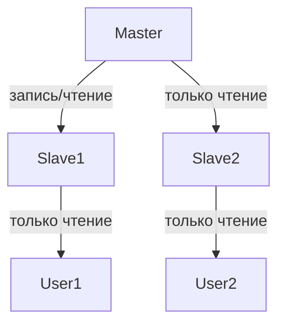
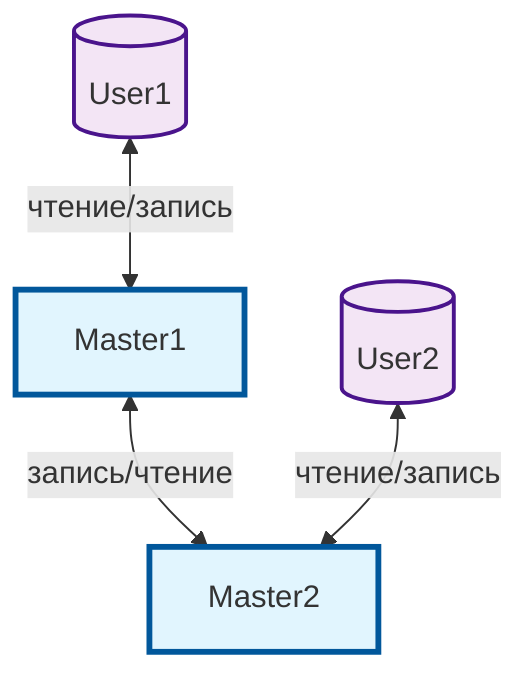
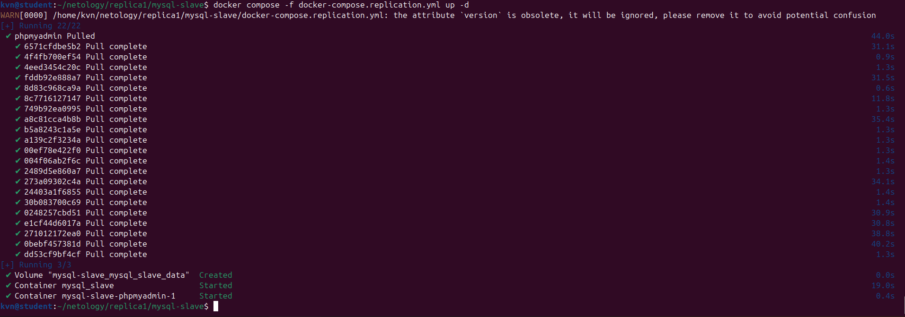
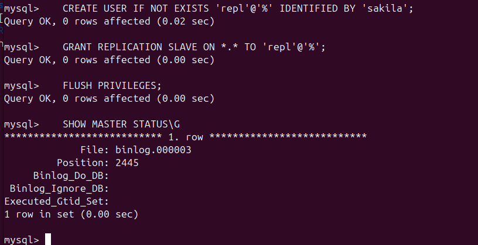
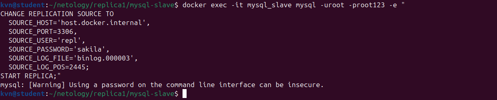
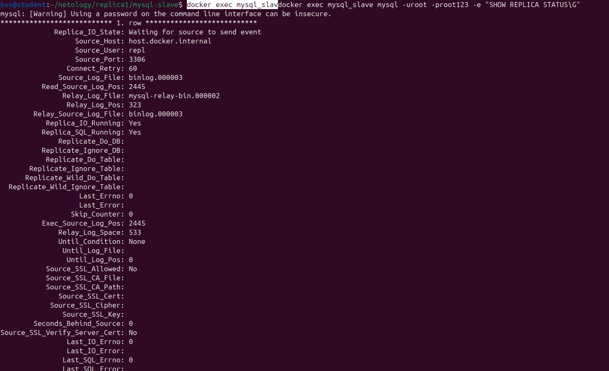
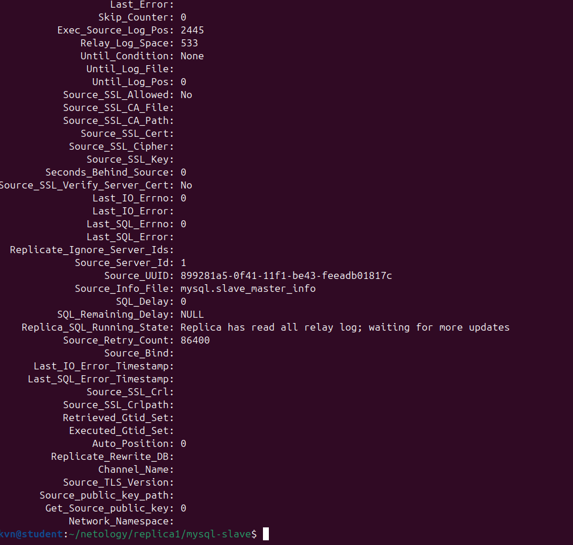
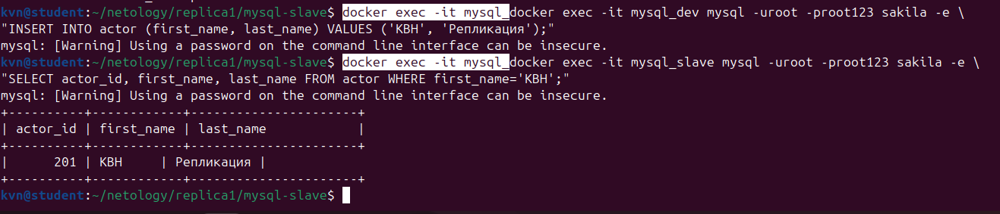

# Домашнее задание к занятию "Репликация и масштабирование. Часть 1" - Кучин Виталий

### Инструкция по выполнению домашнего задания

   1. Сделайте `fork` данного репозитория к себе в Github и переименуйте его по названию или номеру занятия, например, https://github.com/имя-вашего-репозитория/git-hw или  https://github.com/имя-вашего-репозитория/7-1-ansible-hw).
   2. Выполните клонирование данного репозитория к себе на ПК с помощью команды `git clone`.
   3. Выполните домашнее задание и заполните у себя локально этот файл README.md:
      - впишите вверху название занятия и вашу фамилию и имя
      - в каждом задании добавьте решение в требуемом виде (текст/код/скриншоты/ссылка)
      - для корректного добавления скриншотов воспользуйтесь [инструкцией "Как вставить скриншот в шаблон с решением](https://github.com/netology-code/sys-pattern-homework/blob/main/screen-instruction.md)
      - при оформлении используйте возможности языка разметки md (коротко об этом можно посмотреть в [инструкции  по MarkDown](https://github.com/netology-code/sys-pattern-homework/blob/main/md-instruction.md))
   4. После завершения работы над домашним заданием сделайте коммит (`git commit -m "comment"`) и отправьте его на Github (`git push origin`);
   5. Для проверки домашнего задания преподавателем в личном кабинете прикрепите и отправьте ссылку на решение в виде md-файла в вашем Github.
   6. Любые вопросы по выполнению заданий спрашивайте в чате учебной группы и/или в разделе “Вопросы по заданию” в личном кабинете.
   
Желаем успехов в выполнении домашнего задания!
   
### Дополнительные материалы, которые могут быть полезны для выполнения задания

1. [Руководство по оформлению Markdown файлов](https://gist.github.com/Jekins/2bf2d0638163f1294637#Code)

---

### Задание 1
1) 

| Параметр    | Значение                               |
| ----------- | -------------------------------------- |
| Направление | Одностороннее (Master > Slave)         |
| Запись      | Только Master                          |
| Чтение      | Master + все Slaves                    |
| Конфликты   | НЕТ (единая точка записи)            |
| Failover    | Slave > Master (ручной/автоматический) |
| Задержка    | Асинхронная (секунды)                  |

2)

| Параметр    | Значение                            |
| ----------- | ----------------------------------- |
| Направление | Двунаправленное (Master1 <-> Master2) |
| Запись      | Оба Master                          |
| Чтение      | Оба Master                          |
| Конфликты   | ДА (race conditions)              |
| Failover    | Автоматический (active-active)      |
| Задержка    | Асинхронная (может быть рассинхрон) |

3) 
| Аспект                  | Master-Slave   | Master-Master                |
| ----------------------- | -------------- | ---------------------------- |
| Точка записи            | 1 (Master)     | Много (все Masters)          |
| Конфликты данных        | НЕТ            | ДА (нужен LAST UPDATE WIN) |
| Сложность               | Простая        | Высокая                      |
| Масштабируемость записи | - Только 1     | + Горизонтальная             |
| Read scaling            | + Много Slaves | + Много Masters              |
| PostgreSQL              | + Нативно      | - BDR/внешние                |
| MySQL                   | + Нативно      | + Нативно                    |

4)  
Master-Slave   
├── + Простота  
├── + Read scaling (LOAD BALANCER → Slaves)    
├── + Failover (Patroni/PGBouncer)  
└── + PostgreSQL native  
  
Master-Master (PostgreSQL)  
├── -Конфликты  
├── -Сложность  
├── + Только MySQL/MariaDB  
└── + Logical Replication (BDR)  

### Задание 2

1) Запускаем сеть для контейнеров: 
   docker network create mysql_replication_net  
   docker network connect mysql_replication_net mysql_dev  

2) Создаем и запускаем контейнер для Slave при помощи dockerfile и запускаем его.  
3) Подключимся к мастеру: docker exec -it mysql_dev mysql -uroot -proot123.  
4) Создаем нового пользователя с правами 
   CREATE USER IF NOT EXISTS 'repl'@'%' IDENTIFIED BY 'sakila';
   GRANT REPLICATION SLAVE ON *.* TO 'repl'@'%';
   FLUSH PRIVILEGES;
5) Получим информацию о состоянии двоичных лог-файлов исходного сервера и зафиксируем File и Positions SHOW MASTER STATUS\G.  
6) Скачаем дамп БД из мастера: docker exec mysql_dev mysqldump -uroot -proot123 sakila > sakila_dump.sql
7) Создадим в Slave БД sakila: docker exec -it mysql_slave mysql -uroot -proot123 -e "CREATE DATABASE IF NOT EXISTS sakila;"  
8) Импортируем БД в Slave: docker exec -i mysql_slave mysql -uroot -proot123 sakila < sakila_dump.sql
9) Настроим репликацию и проверим: docker exec mysql_slave mysql -uroot -proot123 -e "SHOW REPLICA STATUS\G".  
10) Проверка.  
    **ДЛЯ MASTER.**  
    docker exec -it mysql_docker exec -it mysql_dev mysql -uroot -proot123 sakila -e "INSERT INTO actor (first_name, last_name) VALUES ('КВН', 'Репликация');"  
    **ДЛЯ SLAVE.**  
    docker exec -it mysql_docker exec -it mysql_slave mysql -uroot -proot123 sakila -e "SELECT actor_id, first_name, last_name FROM actor WHERE first_name='КВН';"
11) 
| Сервер | Режим | Порт | Функции                | Статус               |
| ------ | ----- | ---- | ---------------------- | -------------------- |
| Master | RW    | 3306 | Запись, чтение, binlog |  binlog.000003:2445 |
| Slave  | RO    | 3307 | Чтение, репликация     |  Yes/Yes/0          |        

Ссылки на файлы.  
<a href="../mysql-slave/docker-compose.replication.yml" target="_blank"> Файл docker-compose.replication.yml</a>  
<a href="../mysql-slave/slave.cnf" target="_blank"> Файл slave.cnf</a>  

Скриншоты.  
  

    
    
    

### Задание 3*

1) 

Скриншоты.  
  

    

